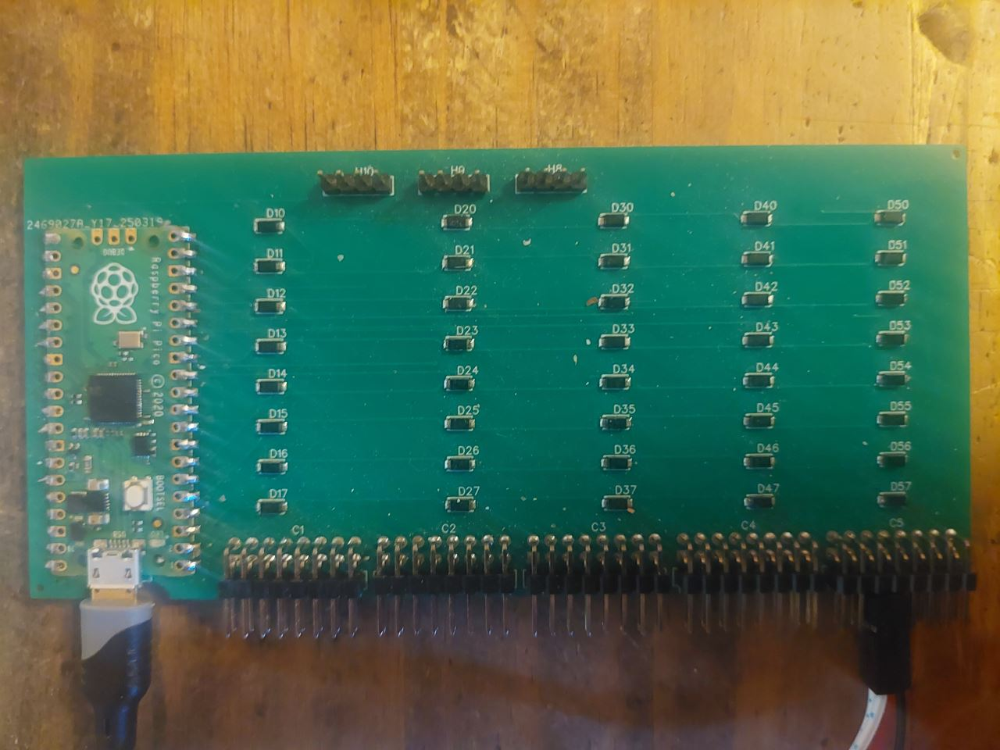

# shapeless_rp2040_40keys



*A short description of the keyboard/project*

* Keyboard Maintainer: [crocsg](https://github.com/crocsg)
* Hardware Supported: *shapeless keyboard*
* Hardware Availability: *You need to bild your own or buy it from gerber file*

This firmware use standard QMK environment. To build the project you need to copy the shapeless_rp2040_40keys into the keyboards folder of your QMK environment.

See the [build environment setup](https://docs.qmk.fm/#/getting_started_build_tools) and the [make instructions](https://docs.qmk.fm/#/getting_started_make_guide) for more information. Brand new to QMK? Start with our [Complete Newbs Guide](https://docs.qmk.fm/#/newbs).

# Instruction for build 
using the QMK cli :
```qmk compile -kb shapeless_rp2040_40keys -km default ```

you will find the firmware *shapeless_rp2040_40keys_default.uf2* in the `.build` folder of your QMK environment .


## Bootloader

Enter the bootloader in 3 ways:

The bootloader is the standard pico bootloader. To flash firmware simply enter bootloader by pressing the button on the raspberry pi pico board while connecting usb cable. Then you can copy the firmware *shapeless_rp2040_40keys_default.uf2* on the virtual drive created by the bootloader.